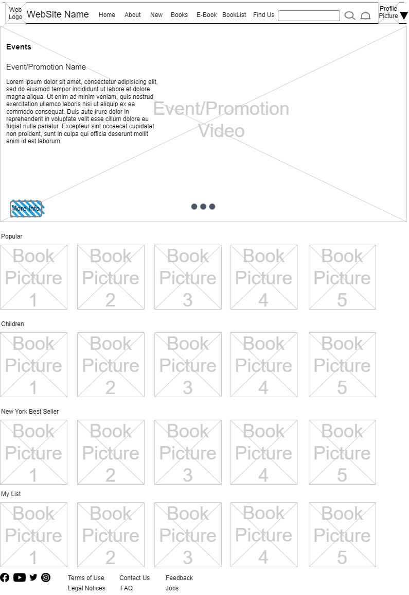
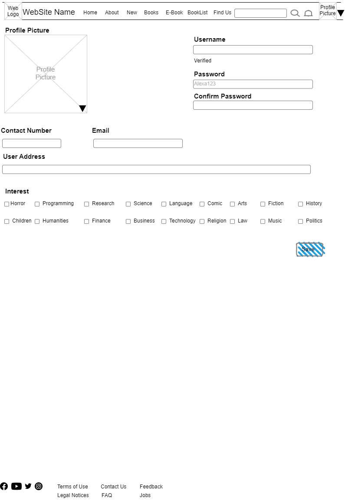
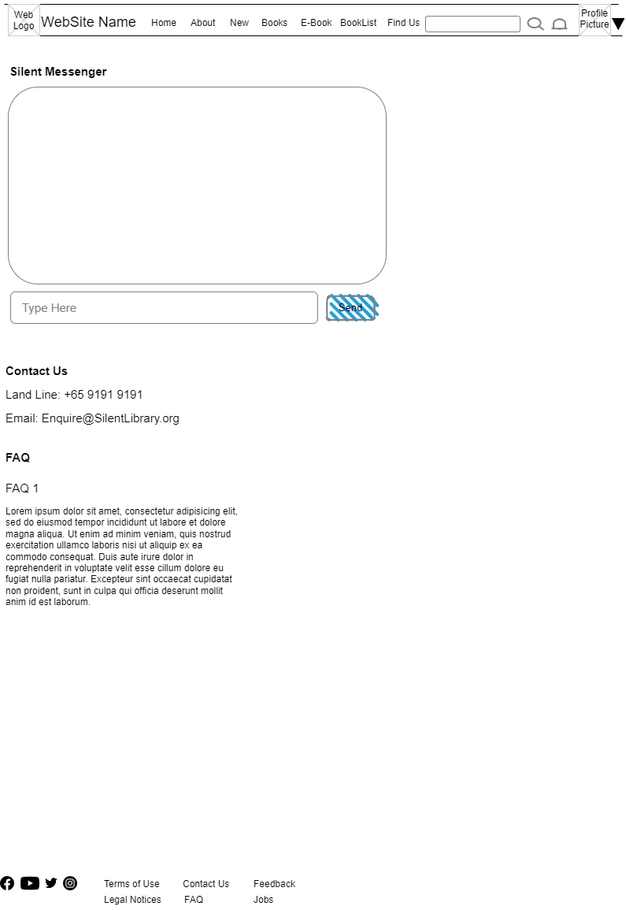
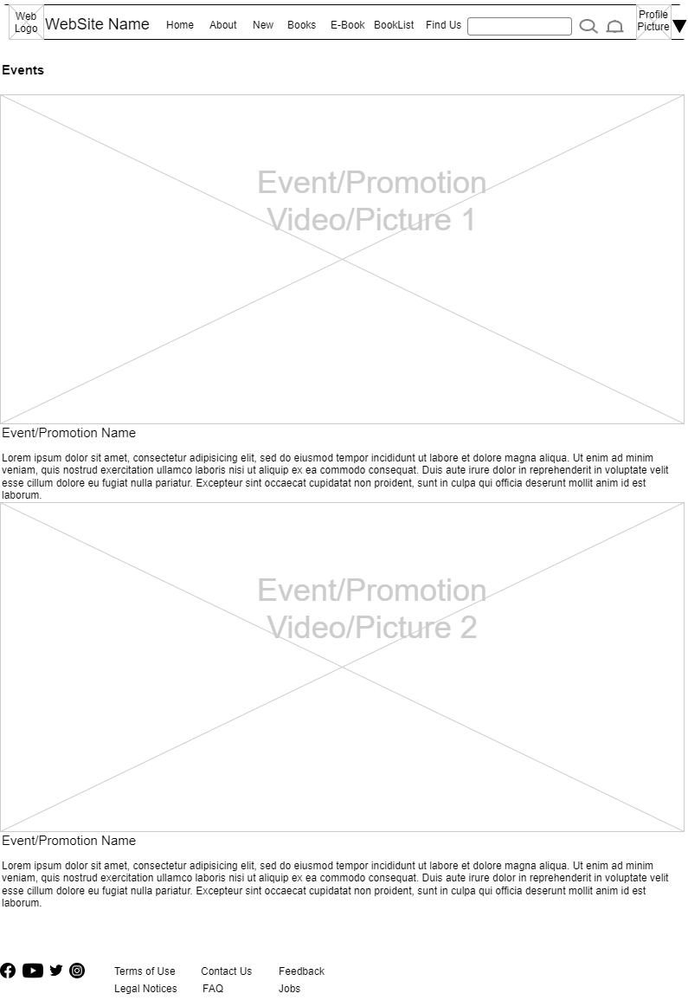
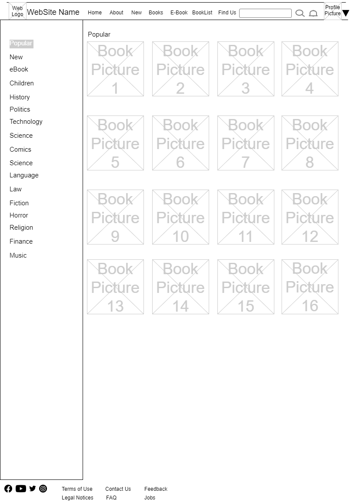
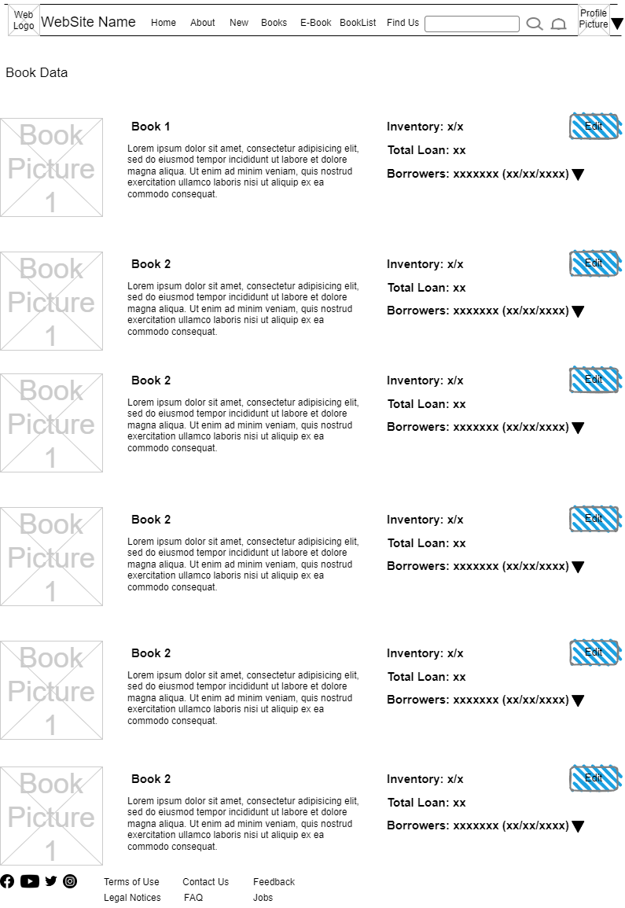
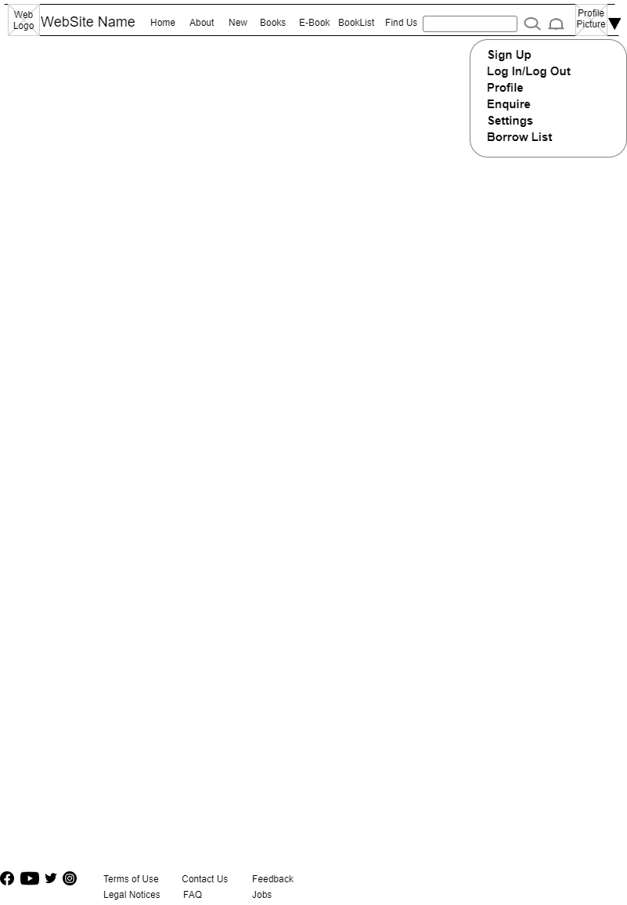
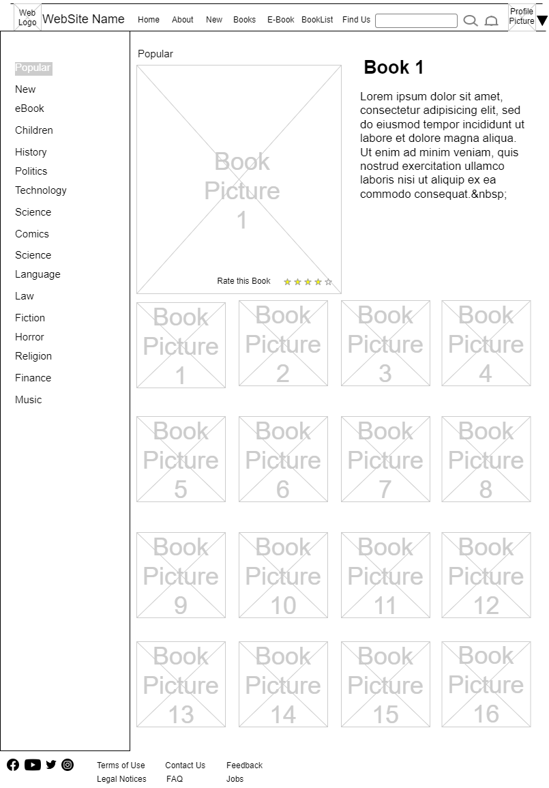

{width="1.4166666666666667in"
height="0.5882764654418198in"}

**Formative Assignment 1**

  Developer:   Umar Bin Kasan

-------------- ----------------

| {width="2.6743055555555557in" height="2.386111111111111in"} |            Plan a website             |
| :----------------------------------------------------------: | :-----------------------------------: |
|                        Silent Library                        |           Develop Branding            |
|                        WEBSITE DESIGN                        | Wireframes , Information Architecture |
|                          Umar Kasan                          | Storyboard based on user requirements |

[Project Objective 1](#project-objective)

[Design Requirements 1](#design-requirements)

[Additional request from Client 1](#additional-request-from-client)

[Branding Logo 1](#branding-logo)

[Brand Colour Scheme 1](#brand-colour-scheme)

[User Research & Profiling 2](#user-research-profiling)

[Content Review and Auditing 3](#content-review-and-auditing)

[Information Architecture 4](#information-architecture)

[Sitemap 5](#sitemap)

[Wireframe 6](#wireframe)

[Home Page 6](#home-page)

[Profile Page 7](#profile-page)

[Enquiry, Contact us & FAQ Page 8](#enquiry-contact-us-faq-page)

[Events Page 9](#events-page)

[Book List Page 10](#book-list-page)

[About Us Page 11](#about-us-page)

[Events Page 12](#events-page-1)

[Storyboard 13](#storyboard)

[Header (Part 1) 13](#header-part-1)

[Header (Part 2) 14](#header-part-2)

[Header (Part 3) 15](#header-part-3)

[Booklist 16](#booklist)

# Project Objective

### To develop a website for Silent Library to support the following features with landing page, sitemap, contact page, privacy policy with common header and footer.

# Design Requirements

-   ### Books List

-   ### Borrowers List

-   ### Library Events and Promotions

-   ### Enquiry form regarding the events

-   ### Library members registration

# Additional request from Client

-   ### Increase membership from 1500 to 1530 in 3 months

-   ### Website to be in Silent Library Color theme

- ### Design to attract member from all ages

  # Branding Logo

# {width="1.5379035433070867in" height="1.3722222222222222in"}

# Brand Colour Scheme

  Light Theme         
------------- -- -- --

  Dark Theme          

# User Research & Profiling

|           User            | Interest                                                     | User Goals & Needs                                           | SL Goals                                                     |
| :-----------------------: | :----------------------------------------------------------- | :----------------------------------------------------------- | :----------------------------------------------------------- |
|         Children          | -   Comic Books  -   Picture Books -    Magazine   | -   Explore latest children book  -   Easy and Simple to use interface  | -   Convert to Long term                                |
|   Working Professionals   | -   Technical books - Self-Taught -   Newspapers   | - Able to search for specific source materials to solve real world problems -   Up Skill themselves with new knowledge | -Source of feedback for the latest trends in the industry    |
|         Teenagers         | -   Mature Comic Books -   Fashion Easy to do guide - Magazines - Events | -   Explore interesting topics -   Easy to digest books for school and research | -   Main Source of crowd to attract -  Feedback on their interest |
| University Undergraduates | -   Textbooks - Academic Books - Research papers - Newspapers | -   Able to search for specific source materials - Informative dense books for literature reviews | -   Source of feedback for the latest trends in the academic fields |
|          Parents          | - Educational Books - Novels - Story Books - Newspapers | -   Cheap source of educational resource for children - Entertainment while children spend time in Library | - Attract parents to convert children to long term members   |

# Content Review and Auditing

-   Silent Library

-   Terms of use

-   About Us

    -   Logo

    -   Motto

    -   Mission

    -   Vision

    -   History

    -   Goals

-   Find Us

    -   Library (Location & Address)

    -   Location Map

    -   How to get there

-   FAQ

-   Enquire

    -   Chat/ Messenger

-   Contact us

    -   Telephone No.

    -   Email

    -   Operating Hours

-   Book/ eBook

    -   Music

    -   Research

    -   Law

    -   History

    -   Children

    -   History

    -   Language

    -   Science

    -   Technology

    -   Politics

    -   

# Information Architecture

# Sitemap

# Wireframe

## Home Page

{width="5.6618055555555555in"
height="8.225in"}

## Profile Page

{width="5.989583333333333in"
height="8.4375in"}

## Enquiry, Contact us & FAQ Page

{width="7.267361111111111in"
height="8.40625in"}

## Events Page

{width="7.635416666666667in"
height="8.604166666666666in"}

## Book List Page

{width="7.449305555555555in"
height="8.773396762904637in"}

## About Us Page

{width="7.416666666666667in"
height="8.739582239720034in"}

## Events Page

{width="7.611590113735783in"
height="8.634722222222223in"}

# Storyboard

##  Header (Part 1)

{width="7.479166666666667in"
height="8.16388888888889in"}

##  Header (Part 2)

{width="7.541666666666667in"
height="8.489582239720034in"}

## Header (Part 3)

{width="7.541666666666667in"
height="8.489582239720034in"}

## Booklist

{width="7.476388888888889in"
height="8.76744094488189in"}
